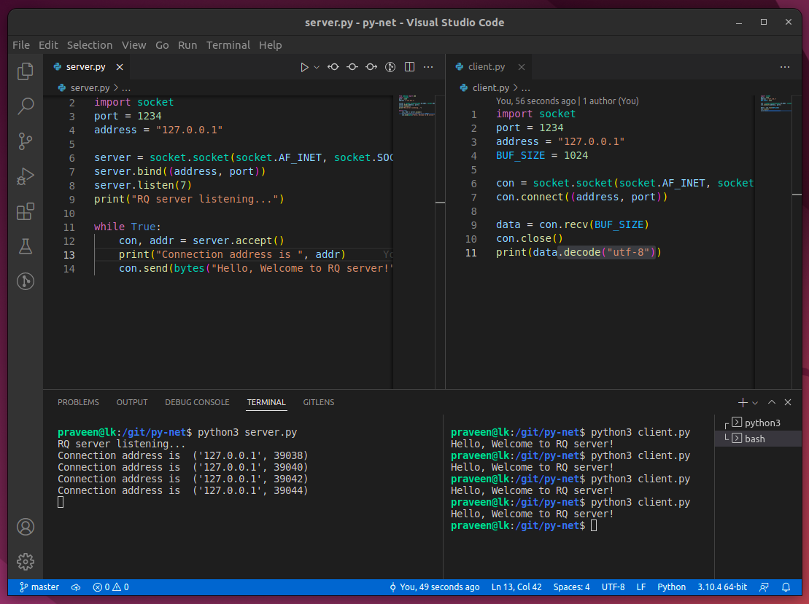
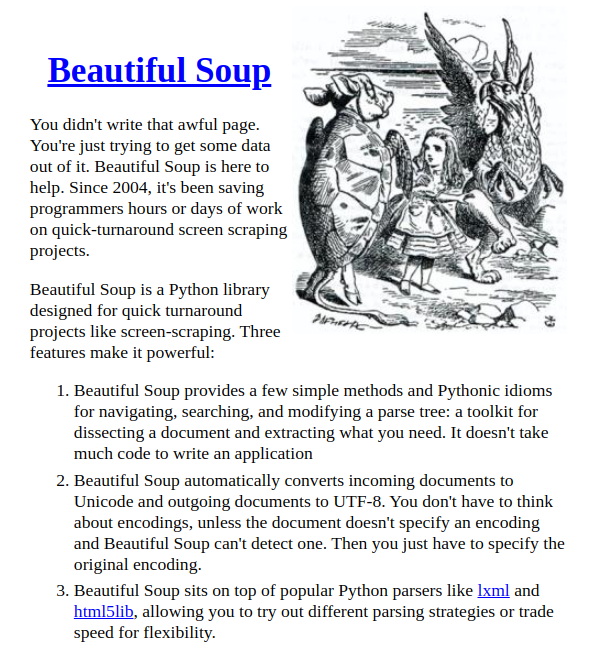
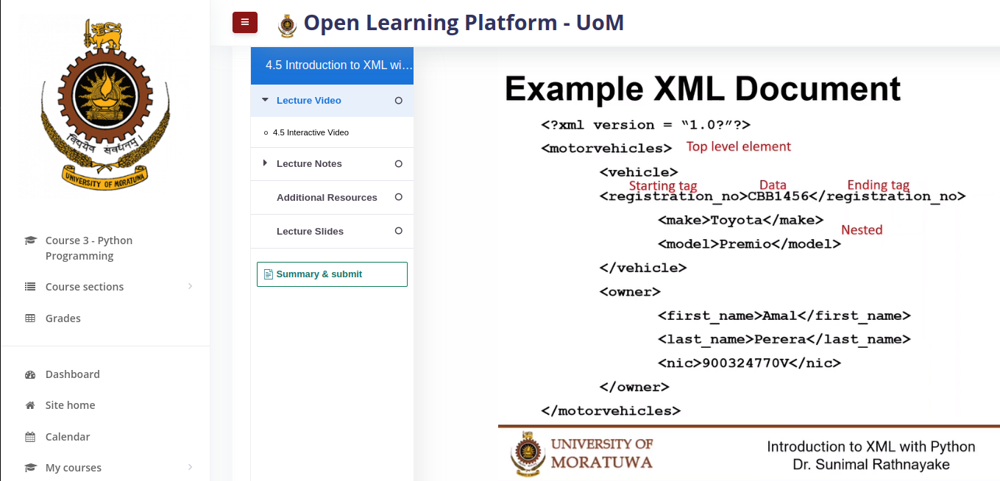

# TCP/IP

## Server = Service providing endpoint in Client-Server architecture

# Beautiful Soup

# XML

## Processing XML

- DOM API (Document Object Model API)
- SAX API (Simple API for XML)
- ET (Element Tree)
